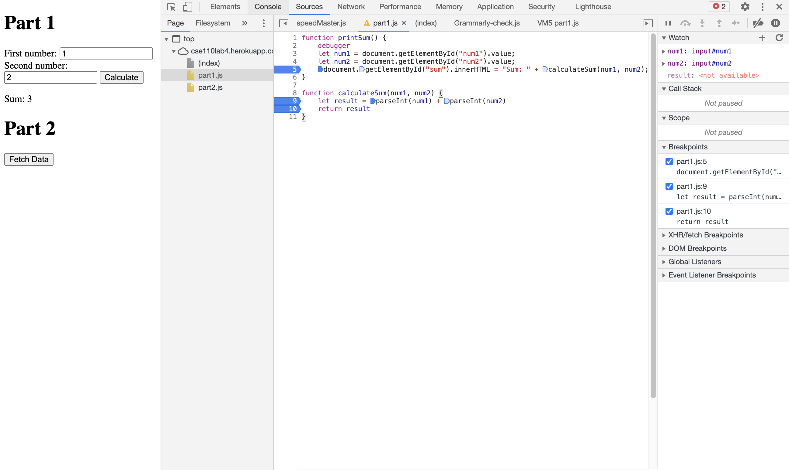

# Part 3

### 1.What is the bug?
The datatype of num1 and num2 are string. So the + operation will concatenate two strings together and return the result of the new concatenated string. That is why the variable result will store "12" if we input 1 and 2 in the webpage.

### 2.How to fix it? Include a screenshot of your fix
When we calculate result = num1 + num2, we can first convert the datatype of num1 and num2 from string to integer by calling function parseInt(). This function will take an input of a string and conver it to its corresponding integer.

### 3. What is the name of the new json file?
The name of the new json file is citylots.json

### 4. Which file initiated the download of the new file?
It is the part2.js file initialized the downloading. More specifically, it is the function fetchData inside the part2.js initialized the dowloading of citylots.json

### 5. What is its file size?
The size of citylots.json is 11.7MB

### 6. How long did it take to download?
The time it took to finish downloading  is 3.04s

### 7.What was your User-Agent for the browser that made the request?
User agent is: Mozilla/5.0 (Macintosh; Intel Mac OS X 11_2_3) AppleWebKit/537.36 (KHTML, like Gecko) Chrome/88.0.4324.150 Safari/537.36

### 8.In the response, what type of server did it come from?
Server is: Apache

### 9.When was the file last modified?
The file was last modified at: Tue, 26 Jan 2021 22:14:13 GMT

### 10. What was the Content-Type of the file?
Content type is: application/json

### 11. Which method inside the initiating file made the request?
The method is fetchData in part2.js